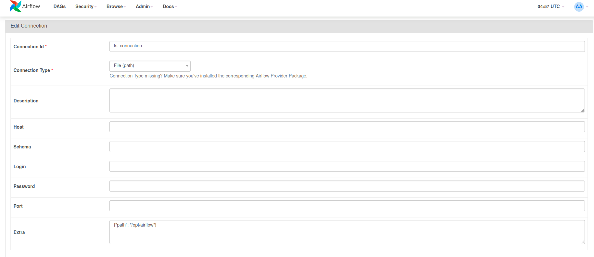

В примере используются данные из датасета sklearn load_breast_cancer. Все даги реализованы с помощью DockerOperator.

Для поднятия контейнеров:
~~~
docker compose up --build
~~~

Конфигурация соединения FileSensor с локальной файловой системой: 
